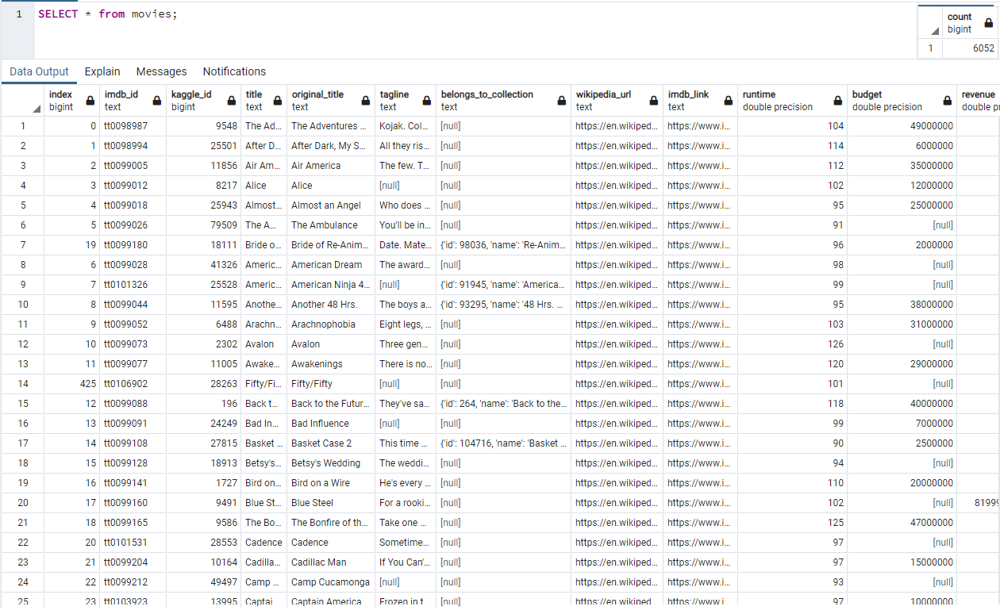
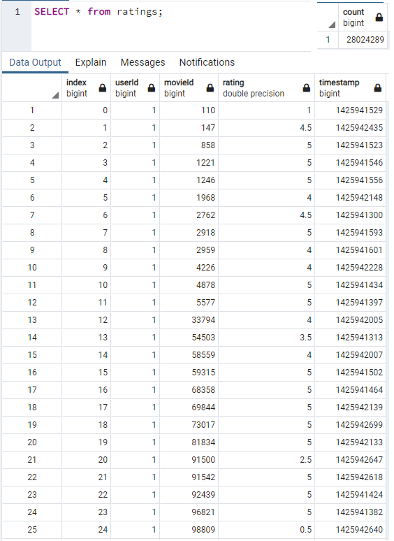

# ETL – Extra, Transform, Load: creating an automated pipeline to generate an SQL database from messy data 

## Overview
Amazing Prime’s online streaming service, Amazing Prime Video, is hosting a hackathon for the community to develop an algorithm to predict which low budget movies will become popular.  This event will require a data source to test potential algorithms against.  Amazing Prime has asked me to create a clean SQL table of video data using data from Wikipedia and Kaggle to provide to the participants.

## Tools
- `Python` 3.7 with the `pandas`, `numpy`, `sqlAlchemy`,  `psycopg2` libraries.
- `postgreSQL` 13
- raw datasets:
	- [wiki-movies-data](Resources/wikipedia.movies.json)
	- [kaggle-movies-metadata](Resources/movies_metadata.csv)
	- [ratings](Resources/ratings.csv)

## Results
**Table 1**: Example movies from the movies query.  The number of rows is included in the upper righthand corner.

**Table 2**: Example ratings from the ratings query.  The number of rows is included in the upper righthand corner.

